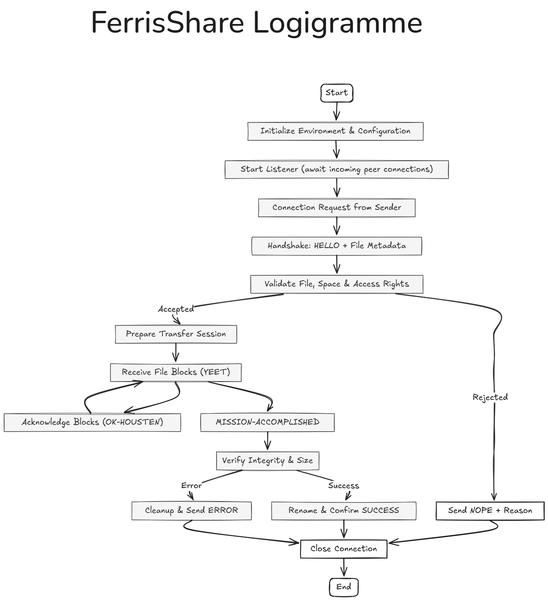
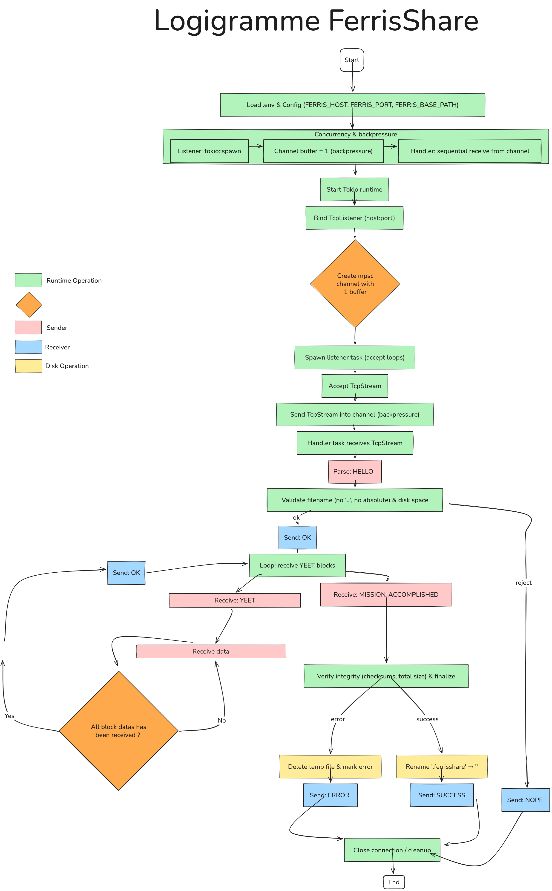

# FerrisShare - P2P File Transfer Protocol

## 1. Project Definition

### What is FerrisShare?

FerrisShare is a peer-to-peer (P2P) file transfer command-line tool that enables direct file sharing between two computers on the same network without requiring a central server. Built in Rust, it prioritizes reliability, concurrent connection handling, and a simple custom protocol for efficient file transfers.

### Goals

The primary goals of this project are:

1. **Direct P2P Transfer**: Enable users to send files directly to another machine using only an IP address and port number
2. **Bidirectional Operation**: Support both sending and receiving modes within a single binary
3. **Concurrent Handling**: Allow a receiver to accept multiple simultaneous file transfers from different senders
4. **Reliability**: Implement a simple protocol with handshake verification to ensure successful transfers
5. **Simplicity**: Provide a straightforward CLI interface similar to common networking tools

- **Resume Support**: Interrupted transfers cannot be resumed
- **Multi-file Transfers**: Each transfer handles exactly one file

### 1.1 **Choice of Dependencies**

This project uses a small set of well-established crates chosen to support an async, networked CLI tool implemented in Rust. Below are the main dependencies and why they were selected.

#### Tokio

Tokio is the async runtime and is central to the project. Reasons for using Tokio include:

1. **Asynchronous I/O efficiency** – Tokio leverages Rust’s `async/await` syntax to handle many simultaneous client connections without blocking threads.
2. **Task scheduling and runtime** – Tokio includes a lightweight task scheduler that runs asynchronous functions concurrently on a single or multi-threaded runtime.
3. **Ecosystem integration** – Many crates (like `warp`, `hyper`, `reqwest`, `tokio-tungstenite`) are built on top of Tokio, ensuring compatibility and extensibility.
4. **Performance and safety** – The runtime is optimized for low-latency operations while preserving Rust’s memory- and thread-safety guarantees.

Practical notes for this repo:

- Tokio primitives used: `TcpListener`, `TcpStream`, `tokio::spawn`, `tokio::fs`, and `tokio::sync::mpsc`.
- The code creates an `mpsc::channel::<TcpStream>(1)` in `src/main.rs` and sends accepted `TcpStream`s from the listener to the handler task. This decouples socket acceptance from protocol handling, provides backpressure (buffer size 1), and keeps a clear service boundary between network IO and command processing.
- When changing concurrency or channel buffer sizes, review the places that consume the channel (network handler) and tests that rely on the current backpressure semantics.

#### clap

`clap` (with the `derive` feature) is used for command-line parsing. It provides ergonomic derive-based parsing for flags and subcommands used by the binaries (see `src/cli/main.rs`). Use `clap` to add user-facing options, help text, and subcommands. Keep CLI changes backward-compatible where possible.

#### dotenv

`dotenv` is used in `src/main.rs` to load local environment variables from a `.env` file during development. The project uses environment variables for configuration keys (see `src/application/config.rs`): `FERRIS_BASE_PATH`, `FERRIS_PORT`, and `FERRIS_HOST`. `Config::from_env()` provides sensible defaults when vars are absent.

Other dependencies

- `async-trait` — used to express async traits for domain ports/interfaces implemented by infra repositories.
- `anyhow` — convenience error handling for higher-level paths or tooling code.

If you add dependencies, prefer small, widely-used crates and keep Tokio feature flags minimal to avoid pulling unnecessary code.

### 1.2 **Overview**

The protocol defines a simple, **text-based command layer** over TCP for transferring a single file between two peers on the same network. It relies on TCP for reliable, ordered delivery, while adding **application-level commands** to coordinate the transfer, manage file chunks, and confirm completion. The connection is **bi-directional**, allowing the receiver to respond directly through the same TCP stream.



#### **Protocol Commands**

| Command                  | Sender | Arguments                                              | Response                   | Description                                                                                      |
| ------------------------ | ------ | ------------------------------------------------------ | -------------------------- | ------------------------------------------------------------------------------------------------ |
| **HELLO**                | Client | `<filename> <filesize>`                                | `OK` / `NOPE <reason>`     | Initiates the file transfer and informs the receiver about the file name and size.               |
| **OK**                   | Server | —                                                      | —                          | Confirms acceptance of the file transfer.                                                        |
| **NOPE**                 | Server | `<reason>`                                             | —                          | Refuses the transfer (e.g., file exists, insufficient space).                                    |
| **YEET**                 | Client | `<block_index> <block_size> <check_sum>` + binary data | `OK-HOUSTEN <block_index>` | Sends one block of the file to the receiver. Blocks are fixed or variable size.                  |
| **OK-HOUSTEN**           | Server | `<block_index>`                                        | —                          | Confirms the block was received and written correctly. Optional but recommended for integrity.   |
| **MISSION-ACCOMPLISHED** | Client | —                                                      | `SUCCESS` / `ERROR`        | Marks the end of file transmission. The server verifies that all blocks were received correctly. |
| **BYE-RIS**              | Either | —                                                      | —                          | Gracefully terminates or cancels the transfer.                                                   |

## 2. **High-Level Architecture**

### 2.1 Overview

FerrisShare is organized following a **hexagonal (ports and adapters)** architecture.
The system is divided into three primary layers:

1. **Core Domain (`src/core/domain`)**
   Defines the business logic, entities, and service traits (ports).
   It is _infrastructure-agnostic_ and models how files are transferred, validated, and finalized.

2. **Application Layer (`src/application`)**
   Orchestrates interactions between domain services and infrastructure.
   It is responsible for:

   - managing runtime state (via `FerrisShareState`),
   - loading configuration from the environment (via `main.rs`),
   - wiring dependencies and initializing services (via `main.rs`).

3. **Infrastructure Layer (`src/infra`)**
   Provides concrete implementations of domain ports, such as:

   - file-system repositories (`fs_storage_repository.rs`),

This separation ensures that **business logic remains pure** and testable while the infrastructure can evolve independently (e.g., changing from filesystem to S3 storage would only require a new repository implementing the same trait).

---

## 3. **Runtime Model**

FerrisShare uses a bounded Tokio mpsc channel (mpsc::channel::<TcpStream>(1)) to forward accepted TcpStream connections from the listener task to the network handler. This decouples socket acceptance from protocol processing, provides backpressure (buffer size = 1) so the listener will await when the handler is busy, and enforces sequential handling of active connections. Do not change the channel semantics or buffer size without review — consumers and tests rely on the current backpressure behavior.

### 3.1 Execution Flow



---

## 4. **Concurrency Model**

FerrisShare uses Tokio’s cooperative multitasking model:

| Component       | Concurrency Mechanism         | Description                                                        |
| --------------- | ----------------------------- | ------------------------------------------------------------------ |
| Listener        | `tokio::spawn` task           | Accepts TCP connections asynchronously.                            |
| Handler         | `mpsc::Receiver<TcpStream>`   | Sequentially handles active connections (bounded by channel size). |
| File IO         | `tokio::fs`                   | Asynchronous file operations for write and rename.                 |
| CPU-bound Tasks | `tokio::task::spawn_blocking` | Used for checksum validation or heavy file operations.             |

> The bounded channel (`size = 1`) acts as a **backpressure control**, ensuring the runtime does not accept more concurrent transfers than it can safely process.

---

## 5. **Storage Design**

### 5.1 Storage Repository

The **FSStorageRepository** provides a file-based implementation of the `StorageRepository` trait defined in `core/domain/storage/ports.rs`.

Responsibilities:

- Validate and sanitize filenames to prevent directory traversal.
- Create a temporary file with suffix `.ferrisshare`.
- Write incoming blocks asynchronously.
- Rename the file to its final name once all blocks are received.

Error handling is implemented using a domain-level `StorageError` enum, with variants such as:

- `InvalidPath`
- `WriteError`
- `FinalizeError`
- `ChecksumMismatch`

---

## 6. **Error Management**

The architecture distinguishes between **domain errors** and **infrastructure errors**:

| Layer       | Error Type                           | Description                                            |
| ----------- | ------------------------------------ | ------------------------------------------------------ |
| Domain      | `StorageError`, `ProtocolError`      | Typed errors expressing semantic issues.               |
| Infra       | `std::io::Error`, `tokio::io::Error` | Low-level I/O or network errors.                       |
| Application | `anyhow::Error`                      | Aggregation or propagation wrapper for untyped errors. |

Each boundary maps its errors upward in a controlled way. For example:

```rust
fn write_block(&self, block: YeetBlock) -> Result<(), StorageError>
```

is converted to `anyhow::Error` only at the CLI or handler layer.

---

## 7. Testing Strategy

- Quick protocol smoke-test with netcat:
  ```bash
  nc 127.0.0.1 9000
  HELLO test.txt 1024
  ```
- Recommended manual verification steps (use when iterating implementation-by-feature):
  1. Start with the listener and the bounded `mpsc` channel; confirm accepted `TcpStream`s are queued and backpressure occurs when full.
  2. Implement protocol command recognition (parser unit tests).
  3. Implement responder behavior and verify correct textual responses (`OK`, `NOPE`, `OK-HOUSTEN`).
  4. Enforce protocol rules and sequencing in the handler (reject invalid sequences).
  5. Execute command handling (dispatch commands to services and capture outcomes).
  6. Implement the `FSStorageRepository` and validate filename sanitization.
  7. Test reading binary payloads from the stream and async writing to the temp file.
  8. Add the CLI path to read a local file and stream its bytes over the connection; verify end-to-end transfer.
  9. Implement and test the loop over `YEET` blocks to ensure all bytes are written and blocks are acknowledged.
- For each manual step, codify a corresponding unit or integration test to prevent regressions.

## 8. **Security Considerations**

- All filenames are sanitized — no absolute or relative (`..`) paths allowed.
- Only local-network communication is assumed; for Internet usage, TLS must be added.
- The server rejects transfers when disk space is insufficient or when the file already exists.
- Protocol commands are ASCII-only to prevent injection or encoding ambiguities.

---

## 9. **Conclusion**

FerrisShare combines Rust’s async capabilities with a clean domain-driven design to deliver a lightweight, robust P2P file transfer CLI.
Its modular architecture (domain/application/infra separation), use of Tokio primitives, and simple custom protocol make it easy to extend while ensuring predictable runtime behavior and strong safety guarantees.
